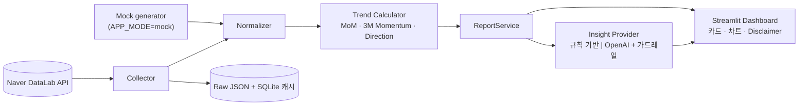

# Age Market Radar

FC 가 상담 전에 고객의 **연령·성별 집단**에서 최근 어떤 보험 주제의 **검색 관심도**가 오르거나 내리는지 30초 안에 파악하게 돕는 PoC.

> 검색 관심도 ≠ 실제 판매량 ≠ 개인 고객에게 필요한 보험

## Problem Statement
FC 는 "이 연령대는 요즘 무엇에 관심이 있나?"를 개인 경험·동료 의견·기사에 의존해 판단한다. 이 도구는 상품 추천이 아니라 **관심도 변화를 데이터로 보여주고, 어떤 니즈부터 확인할지** 정리해 준다.

## 화면 구성 (Action-First)
Segment 선택 → **이번 달 상담 준비**(주목 Signal · FC Check Point · 상담 시작 질문) → Topic별 관심 변화 카드(방향 우선, Raw 지수는 상세 지표로) → 3M 평균과 함께 보는 추이 차트 → AI 해석(무엇이 변했나 / 어떻게 해석하나 / 무엇을 물어볼까) → SFA 역할 구분 · 방법론.
시장 Signal → 니즈 **가설** → FC 질문 → 고객 검증 중 앞의 두 단계만 지원하며, 니즈 판단·상품 추천은 하지 않는다. 상담 질문은 `config/topics.yaml` 의 Topic별 질문 은행에서 가져온다. 평가·검증 기록: [docs/PRODUCT_REVIEW.md](docs/PRODUCT_REVIEW.md).

## Architecture

상세 구조도와 요청 흐름(sequence)은 [docs/ARCHITECTURE.md](docs/ARCHITECTURE.md) 참조.
코드 위치: `src/collectors`, `src/processing`, `src/insights`, `src/storage`, `src/service.py`(오케스트레이션), `config/*.yaml`.

## Environment Setup
Python 3.12+ (개발: 3.14).
```powershell
python -m venv .venv
.venv\Scripts\python -m pip install -r requirements.txt
copy .env.example .env
```

## API Key Setup
`.env` (Git 제외)에 입력. 코드/설정 파일에 Key 를 넣지 않는다.
- `NAVER_API_PROVIDER` — `developers`(기본, developers.naver.com 키) 또는 `ncp`(네이버 클라우드 API HUB 키). 맞지 않으면 401.
- `NAVER_CLIENT_ID`, `NAVER_CLIENT_SECRET` — Naver Developers 에서 Application 등록 시 **"데이터랩 (검색어트렌드)"** API 선택 (미선택 시 403). 일 1,000회 제한.
- `OPENAI_API_KEY` — **선택**. 없으면 규칙 기반 요약을 사용하며 핵심 기능은 동일하게 동작.

## How to Run
```powershell
.venv\Scripts\python -m streamlit run app.py
```
실데이터: `.env` 에 `APP_MODE=real` + Naver Key.

## Mock Mode
`APP_MODE=mock`(기본). 가상 데이터를 생성하며 화면 상단에 **DEMO DATA** 배너가 항상 표시된다. 실데이터처럼 쓰지 말 것.

## How to Test
```powershell
.venv\Scripts\python -m pytest                 # Unit + Fixture + Streamlit AppTest(mock) (외부 API 호출 없음)
.venv\Scripts\python -m pytest -m integration  # 실제 Naver API 1건 (Key 없으면 skip)
```

## Metric Definition (project-defined)
- Current = 마지막 완결 월의 검색 관심지수
- MoM% = (Current − 전월) / 전월 × 100
- 3M Momentum% = (Current − 직전 3개월 평균) / 직전 3개월 평균 × 100
- Direction: ≥ +5% UP / ≤ −5% DOWN / 그 사이 STABLE (`config/app_config.yaml`)
- Topic 정의는 `config/topics.yaml` (변경 시 `topics_version` 갱신)

자세한 내용: [docs/DATA_METHODOLOGY.md](docs/DATA_METHODOLOGY.md)

## Data Limitation
절대 검색량·판매량·개인 수요가 아님 / Keyword 선택에 따라 결과 변동 / ratio 는 Request 마다 최댓값=100 으로 재정규화되므로 **다른 Request(연령·성별·기간) 간 값 비교 금지** / "건강보험"은 국민건강보험 검색이 섞일 수 있음.

## Project Status
실제 Naver API 연결과 Smoke Test 1~3 은 2026-10-07 에 수행했다 (DATA_METHODOLOGY §7). "건강보험" Keyword 는 의미 혼재로 Direction 이 불안정해 헤드라인 Signal 에서 제외한다 (§8). OpenAI 경로는 실호출 검증 전이다.

## Future Roadmap
[ROADMAP.md](ROADMAP.md) 참조.
