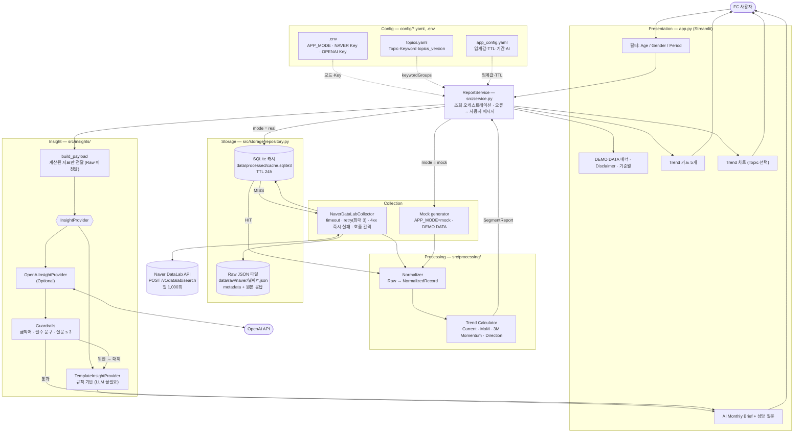
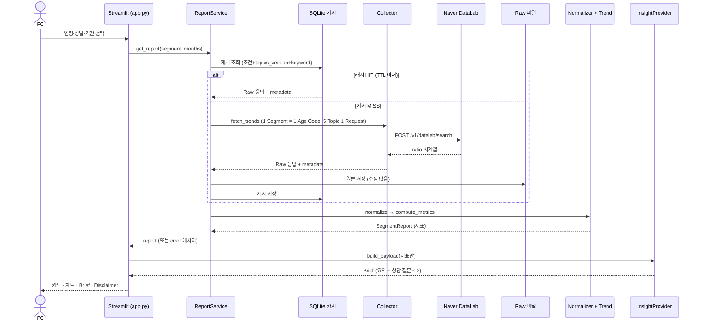

# ARCHITECTURE

실제 코드(`src/`) 기준 구조도. Mermaid 는 GitHub / VS Code(Markdown Preview Mermaid) 에서 렌더링된다.

## 1. 전체 시스템 구조

## 2. 요청 흐름 (실데이터 모드)

## 3. 설계 원칙 (다이어그램에 반영된 부분)

| 원칙 | 구조상 반영 |
|---|---|
| 계산은 Python, AI 는 설명만 | LLM 은 `build_payload` 의 계산된 지표만 입력으로 받음 (Trend Calculator 뒤에 위치) |
| LLM 없이도 핵심 기능 동작 | Provider 가 `TemplateInsightProvider` 로 분리, Key 없으면 자동 사용 |
| AI 출력 통제 | Guardrails 위반·LLM 실패 시 Template 로 대체 |
| Mock/실데이터 혼동 방지 | Mock 은 Raw·캐시에 저장하지 않고 `DEMO DATA` 배너 고정 |
| ratio 재정규화 문제 | 캐시 키에 기간·성별·연령·keyword 포함, 같은 윈도우를 한 번에 재조회 |
| 장애 격리 | Service 가 모든 예외를 `SegmentReport.error` 로 변환 → UI 는 Crash 없이 안내 |
